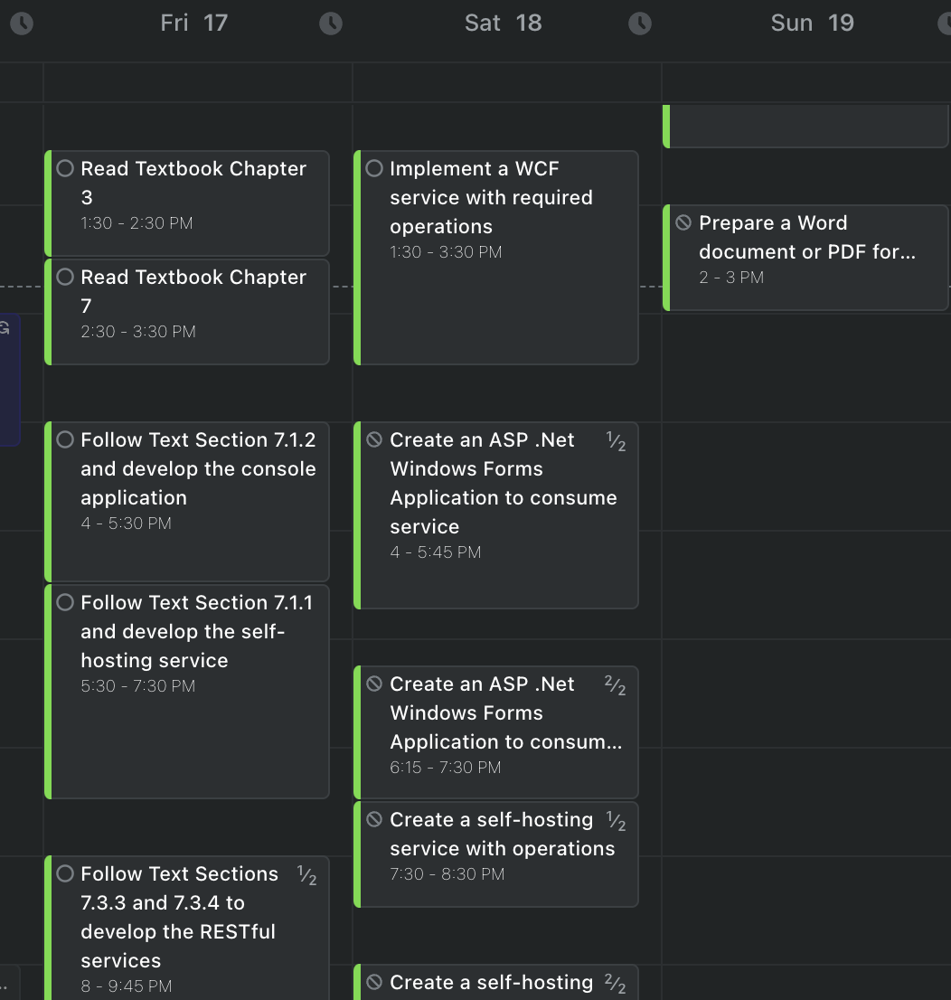
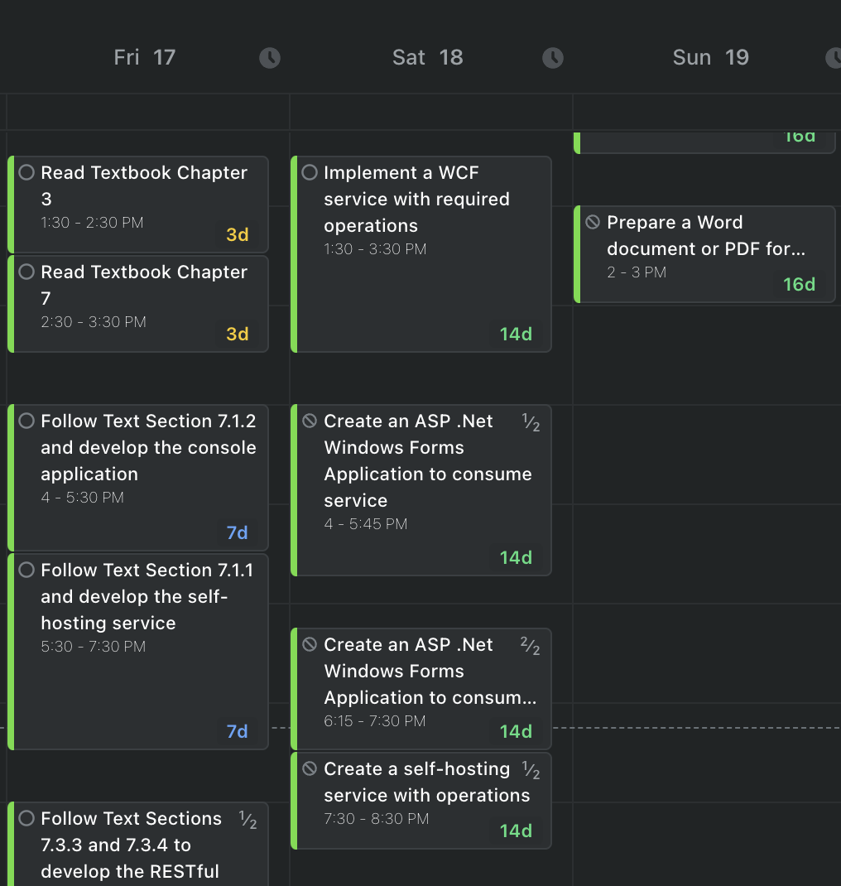

# Motion Task Extension

## Important Note
This is a demonstration project created for educational and portfolio purposes to showcase technical skills including API integration, rate limiting implementation, Chrome extension development, and real-time DOM manipulation. This project is not intended for production use or distribution.

## Project Overview

A Chrome extension that demonstrates integration with Motion's REST API to enhance task visualization. The extension adds dynamic due date indicators to Motion tasks and implements sophisticated rate limiting.

## Key Technical Implementations

### 1. Rate Limiting System
```javascript
class RateLimiter {
    constructor(maxRequests, perMinutes = 1) {
        this.maxRequests = maxRequests;
        this.perMinutes = perMinutes;
        this.requests = [];
    }

    async waitForAvailableSlot() {
        const now = Date.now();
        const windowMs = this.perMinutes * 60 * 1000;
        this.requests = this.requests.filter(time => now - time < windowMs);
    }
}
```
The rate limiter uses a sliding window algorithm to ensure compliance with API limits while maximizing throughput. This implementation:
- Tracks request timestamps in a rolling window
- Automatically queues requests when approaching limits
- Provides built-in request retry functionality

### 2. Dynamic DOM Observation
```javascript
function setupTaskObserver(tasksData) {
    const observer = new MutationObserver((mutations) => {
        mutations.forEach(mutation => {
            mutation.addedNodes.forEach(node => {
                if (node.nodeType === Node.ELEMENT_NODE) {
                    if (node.matches('[data-event-id^="task|"]')) {
                        processTaskElement(node, tasksData);
                    }
                }
            });
        });
    });
}
```
The MutationObserver implementation handles:
- Dynamic content loading
- Task updates in real-time
- Efficient DOM manipulation

## Testing Instructions (For Review Purposes)

### Local Installation
1. Clone this repository:
```bash
git clone https://github.com/yourusername/motion-task-extension.git
```

2. Open Chrome and navigate to:
```
chrome://extensions/
```

3. Enable "Developer mode" in the top right corner

4. Click "Load unpacked" and select the cloned repository folder

5. Configure the extension:
   - Click the extension icon
   - Select "Options"
   - Enter a Motion API key (requires a Motion account)

### Testing Functionality
1. Navigate to Motion's web application
2. The extension will automatically:
   - Fetch workspace and task data
   - Add due date indicators to tasks
   - Update dynamically as you interact with tasks

### Expected Behavior
- Tasks should display color-coded due date indicators
- Due dates update automatically
- Rate limiting ensures smooth API interaction

## Technical Deep Dive

### API Integration
The extension interacts with several Motion API endpoints:
- `/workspaces` - Fetches available workspaces
- `/tasks` - Retrieves task data with pagination
- Handles API responses with comprehensive error checking

### Data Processing
```javascript
async function processTaskElement(taskElement, tasksData) {
    const taskInfo = extractTaskInfo(taskElement);
    const matchingTask = findMatchingTask(taskInfo, tasksData);
    if (matchingTask && matchingTask.dueDate) {
        addDaysUntilDue(taskElement, matchingTask.dueDate);
    }
}
```
Tasks are processed through multiple stages:
1. Information extraction from DOM
2. Matching with API data
3. Visual enhancement application

## Lessons Learned

### 1. Rate Limiting Challenges
- Implementing a sliding window algorithm
- Balancing performance with API compliance
- Handling edge cases in request timing

### 2. DOM Manipulation
- Efficient event handling
- Managing dynamic content updates
- Preventing memory leaks

### 3. API Integration
- Handling pagination effectively
- Error recovery strategies
- Data synchronization patterns

## Feature Demo

This is a feature demo using a segment of my own calendar!

### Before Extension


### After Extension



## Project Structure
```
motion-task-extension/
├── manifest.json        # Extension configuration
├── content.js          # Main functionality
└── options.html        # API key configuration
```

## Technologies Used
- JavaScript (ES6+)
- Chrome Extension APIs
- Motion REST API
- MutationObserver API
- Chrome Storage API

## License
This project is for demonstration purposes only. Not for commercial use or distribution.

---
Created by Cassandra Coppo for technical demonstration and portfolio purposes.
